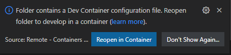
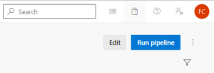
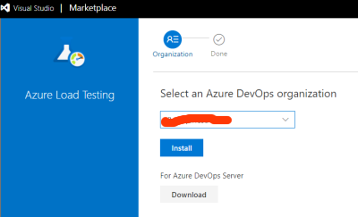
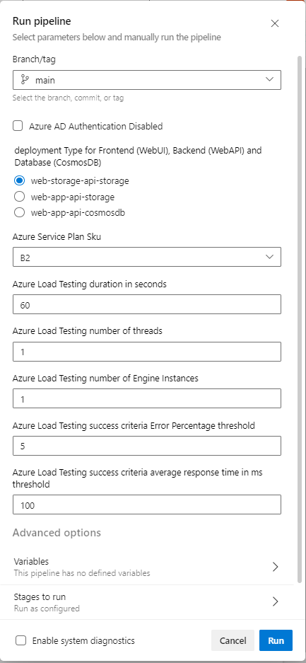
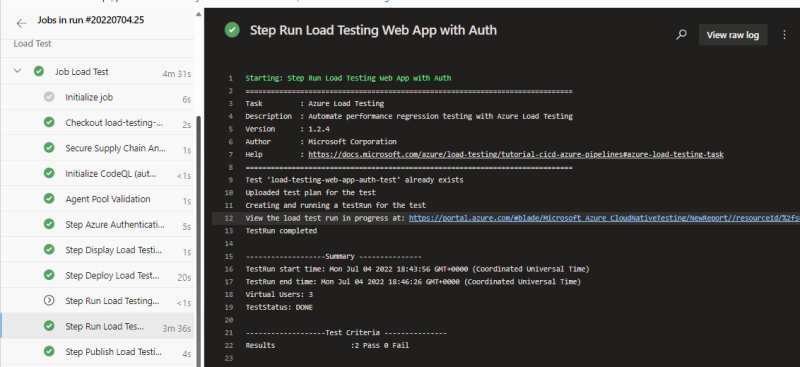
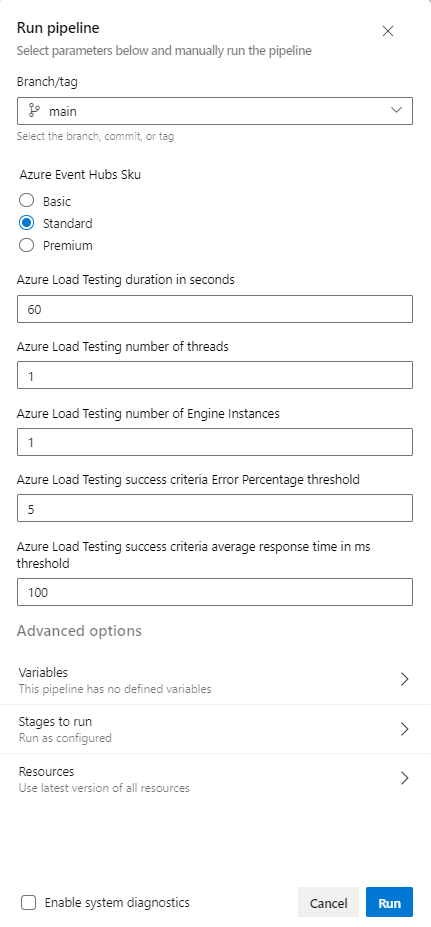
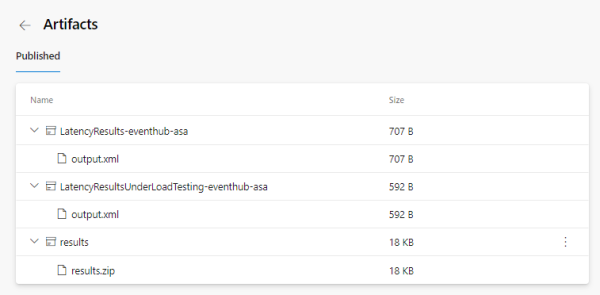

# Using Azure Load Testing and Measring Latency  

# Table of Contents
- [Introduction](#introduction)
- [Overview](#Overview)
- [Getting started](#getting-started)
- [Using Azure DevOps pipelines](#using-azure-devops-pipelines)
- [Under the hood](#under-the-hood)
- [Contribute](#contribute)
- [Next Steps](#next-steps)
 
# Introduction
This repository contains several Azure Load Testing scenarios to test and to identify any bottleneck in different infrastructures and services:
1. The first scenario will test a service based on a Web UI, a Web API and a database running on different infrastructure.
2. The second scenario will  test a service based on Azure Event Hubs and Azure Stream Analytics, beyond running the load testing this scenario will also measure the latency in normal condition and in overloaded condition. 
 
Azure Load Testing is a new service in preview, if in the past you use solutions based on this implementation: https://github.com/Azure-Samples/jmeter-aci-terraform to run load testing, you could reuse your load testing configuration files and dataset files (jmx files and csv files) with Azure Load Testing as both implementations are based on (JMeter)[https://jmeter.apache.org/].

This repository contains also Azure DevOps pipelines to run the load testing scenarios. 
The pipelines running Web App load testing will:
- deploy the selected infrastructure,
- build the services
- deploy the services
- run the load testing 
- publish the load testing results  
  
The pipelines running Event Hub and Stream Analytics load testing will:
- deploy the selected infrastructure,
- update the infrastructure for the load testing
- run the load testing and the latency measurement  
- run publish the load testing and the latency results  
- run latency measurement in normal condition 
- publish the latency results 
- update the infrastructure after the load testing

So far, all the services and resources tested while running the load testing are not protected with firewall or connected to a Virtual Network (VNET). Azure Load Testing should support in few months VNET integration, the repository will be updated and extended to run scenarios where the resources are connected to a VNET.

The content in this repository will cover the use cases:

1. You need to deploy a Web App with a frontend, a backend and a database in Azure, you can use Azure Load Testing to select the most efficient infrastructure based on your performance criteria (average response time, error rate).
2. You need to deploy a service based on Azure Event Hubs and Azure Stream Analytics, you want to measure the latency in normal condition or in overload condition with Azure Load Testing.

# Overview

## Web App Architectures

As described in the introduction, this repository contains all the resources to run load testing to select the most efficient Web App infrastructure based on the performance criteria you expect.

The pipeline will deploy different infrastructures running a Web UI, a Web API and a database.

1. Web App Storage architecture:
Web UI Single Page Web UI deployed on Azure Storage ($web container)
Web API deployed in a container running on Azure Function and Azure App Service Plan 
Database using the Azure Storage Table API

    

2. Web App Service architecture:
Web UI Single Page Web UI deployed in a container running on Azure Function and Azure App Serivce Plan
Web API deployed in a container running on Azure Function and Azure App Service Plan 
Database using the Azure Storage Table API
  
    

3. Web App CosmosDB architecture:
Web UI Single Page Web UI deployed in a container running on Azure Function and Azure App Serivce Plan
Web API deployed in a container running on Azure Function and Azure App Service Plan 
Database Azure CosmosDB

    


## Event Hubs and Stream Analytics Architectures

This repository contains also all the resources to run load testing and measure latency of an Event Hubs and Stream Analytics infrastructure. The latency is measured in normal condition or in overload condition with Azure Load Testing.

The latency is the time diffence between the time an "output" event is raised by the service and the time events which should trigger this "output" event are ingested by the system.   

  


The pipeline will deploy different infrastructures supporting Azure Event Hubs and Azure Stream Analytics.

1. Event Hub architecture:
   This architecture is used to run Ingestion load testing against Azure Event Hubs

    
   
2. Event Hub and Stream Analytics architecture:
   This architecture is used to run Ingestion load testing against Azure Event Hubs and to measure the latency to identify any bottleneck in the architecture.
   
    


# Getting started 

This chapter describes how to :
1. Install the pre-requisites including Visual Studio Code, Dev Container
2. Create, deploy and run the different pipelines
  
This repository contains the following resources :
- A Dev container under '.devcontainer' folder
- The Azure configuration for a deployment under 'configuration' folder 
- The pipelines used to run the load testing scenarios and the bash files used to create and run the pipelines under 'devops-pipeline' folder 
- The ARM templates used to deploy the target infrastructure and the load testing resouces under 'infra' folder
- The Web UI source code under 'src/ts-wep-app' folder
- The Web API source code under 'src/dotnet-web-api' folder

## Installing the pre-requisites

In order to test the solution, you need first an Azure Subscription, you can get further information about Azure Subscription [here](https://azure.microsoft.com/en-us/free).

You also need to install Git client on your machine and Visual Studio Code, below the links.

|[](https://git-scm.com/download/win) |[](https://git-scm.com/download/linux)|[](https://git-scm.com/download/mac)  |
| :--- | :--- | :--- |
| [Git Client for Windows](https://git-scm.com/download/win) | [Git client for Linux](https://git-scm.com/download/linux)| [Git Client for MacOs](https://git-scm.com/download/mac) |
[Visual Studio Code for Windows](https://code.visualstudio.com/Download)  | [Visual Studio Code for Linux](https://code.visualstudio.com/Download)  &nbsp;| [Visual Studio Code for MacOS](https://code.visualstudio.com/Download) &nbsp; &nbsp;|

Once the Git client is installed you can clone the repository on your machine running the following commands:

1. Create a Git directory on your machine

```bash
    c:\> mkdir git
    c:\> cd git
    c:\git>
```

2. Clone the repository.  
For instance: 

```bash
    c:\git> git clone https://CSECodeHub@dev.azure.com/CSECodeHub/489735%20-%20Swiss%20Re%20Service%20Insights%20Centre/_git/load-testing-sharing
    c:\git> cd ./load-testing-sharing 
    c:\git\load-testing-sharing> 
```

## Using dev container
This repository contains a folder called '.devcontainer'. 
When you'll open the project with Visual Studio Code, it will ask you to open the project in container mode provided some pre-requisites are installed on your machine.

### Installing Visual Studio Code and Docker
You need to install the following pre-requisite on your machine

1. Install and configure [Docker](https://www.docker.com/get-started) for your operating system.

   - Windows / macOS:

     1. Install [Docker Desktop](https://www.docker.com/products/docker-desktop) for Windows/Mac.

     2. Right-click on the Docker task bar item, select Settings / Preferences and update Resources > File Sharing with any locations your source code is kept. See [tips and tricks](https://code.visualstudio.com/docs/remote/troubleshooting#_container-tips) for troubleshooting.

     3. If you are using WSL 2 on Windows, to enable the [Windows WSL 2 back-end](https://docs.docker.com/docker-for-windows/wsl/): Right-click on the Docker taskbar item and select Settings. Check Use the WSL 2 based engine and verify your distribution is enabled under Resources > WSL Integration.

   - Linux:

     1. Follow the official install [instructions for Docker CE/EE for your distribution](https://docs.docker.com/get-docker/). If you are using Docker Compose, follow the [Docker Compose directions](https://docs.docker.com/compose/install/) as well.

     2. Add your user to the docker group by using a terminal to run: sudo usermod -aG docker $USER

     3. Sign out and back in again so your changes take effect.

2. Install [Visual Studio Code](https://code.visualstudio.com/).

3. Install the [Remote Development extension pack](https://marketplace.visualstudio.com/items?itemName=ms-vscode-remote.vscode-remote-extensionpack)

### Using devcontainer

1. Launch Visual Studio Code in the folder where you stored the av-services repository

    ```bash
        c:\git\load-testing-sharing> code .
    ```

2. Once Visual Studio Code is launched, you should see the following dialgo box:

    

3. Click on the button 'Reopen in Container'
4. Visual Studio Code will now open the devcontainer. If it's the first time you open the project in container mode, it will first build the container, it can take several minutes to build the new container.
5. Once the container is loaded, you can open a new terminal (Terminal -> New Terminal).
6. And you have access to the tools installed in the devcontainer like az client,.... 

    ```bash
        vscode ➜ /workspace $ az account show
    ```

## How to install, deploy, undeploy, build,  ... 

The devcontainer is now running, you can use the bash file: ./devops-pipelines/utils/iactool.sh if you want to deploy manually the infrastructure. 
This chapter describes how to deploy manually the different infrastructures which will be tested. 
Those manual deployment steps are not mandatory to run the load testing, if you are not interested in deploying manually the infrastructure, you can directly jump to the chapter [Using Azure DevOps pipelines](#using-azure-devops-pipelines) to automate the infrastructure deployment.   

With the file iactool.sh you can:
- install the pre-requisites in your devcontainer or in the agent running the pipeline.
- deploy/undeploy the selected infrastructure: it could deploy a virtual machine, a container,...
- Create the Azure Active Directory Application for the Web App infrastructure
- Grant access to the Event Hubs inputs for Stream Analytics for the EventHubs/Stream Analytics infrastructure
- Build the frontend and the backend for the Web App infrastructure
- Deploy the frontend and the backend for the Web App infrastructure

The bash file  ./devops-pipelines/utils/iactool.sh is mainly used by the pipeline to deploy the selected infrastructure.

Below the list of arguments associated with iactool.sh:"
     -a  Sets iactool action {login, install, deploy, undeploy, createapp, buildfe, buildbe, deployfe, deploybe, deployev}
     -c  Sets the iactool configuration file
     -e  Sets the stop on error (false by defaut)
     -s  Sets Silent mode installation or deployment (false by defaut)
     -d  Deployment type: 'web-app-api-cosmosdb', 'web-app-api-storage', 'web-storage-api-storage', 'eventhub', 'eventhub-asa', - by default 'web-storage-api-storage'
     -i  Application Id in Microsoft Graph associated with Web API and Web UI
     -z  Authorization disabled - Azure AD Authorization disabled for Web UI and Web API - by default false
     -k  Service Plan Sku - Azure Service Plan Sku - by default B1
     -h  Event Hub Sku - Azure Event Hub Sku - by default Standard (Basic, Standard, Premium)

### Installing the pre-requisites on the host machine
Follow the steps below to install the pre-requities on your host machine which could be the Azure DevOps Agent.

1. If your machine is not connected to Azure launch the login process using iactool.sh  -a login.  
Usually this step is not required in a pipeline as the connection with Azure is already established. 

```bash
    vscode ➜ /workspace $ ./devops-pipelines/utils/iactool.sh  -a login
```
After this step the variables AZURE_REGION, AZURE_APP_PREFIX, AZURE_SUBSCRIPTION_ID and AZURE_TENANT_ID are set. The file ./configuration/.default.env is updated once the connection with Azure is established.

```bash
    vscode ➜ /workspace $ cat ./configuration/.default.env 
    AZURE_REGION="eastus2"
    AZURE_APP_PREFIX=visit5039
    AZURE_SUBSCRIPTION_ID=XXXXXXXX-XXXX-XXXX-XXXX-XXXXXXXXXXXX
    AZURE_TENANT_ID=XXXXXXXX-XXXX-XXXX-XXXX-XXXXXXXXXXXX
```
AZURE_REGION defines the Azure region where you want to install your infrastructure, it's 'eastus2' by default.
AZURE_APP_PREFIX defines the prefix which will be used to name the Azure resources. By default this prefix includes 4 random digits which are used to avoid naming conflict when a resource with the same name has already been deployed in another subscription. 
AZURE_SUBSCRIPTION_ID is the Azure Subcription Id where you want to install your infrastructure
AZURE_TENANT_ID is the Azure Tenant Id used for the authentication.

2. Once you are connected to Azure, you can launch the installation of the pre-requisites. This command will install .Net Core SDK version 6.X, Typescript, Nodejs which are required to build and deploy the Web App frontent and backend.


```bash
    vscode ➜ /workspace $ ./devops-pipelines/utils/iactool.sh  -a install
```

### Deploying the infrastructure 
Once the pre-requisites are installed, you can deploy the infrastructure you want to test using the following arguments:

    iactool.sh  -a deploy -c ./configuration/.default.env -d <deploymentType>

when 'deploymentType' define the infrastructure you want to deploy:

    - 'web-app-api-cosmosdb': Web App with Web UI on App Service, Web API on Azure Function, CosmosDB Database, 
    - 'web-app-api-storage': Web App with Web UI on App Service, Web API on Azure Function, Storage Table Database,
    - 'web-storage-api-storage': Web App with Web UI on Storage ($web container), Web API on Azure Function, Storage Table Database,
    - 'eventhub': Event Hubs with 2 input eventhubs and 1 output eventhub 
    - 'eventhub-asa': Evnt Hubs with 2 input eventhubs and 1 output eventhub and Stream Analytics

If you deploy a Web App infrastructure you can also select the following options:
    -k : Azure Service Plan Sku. This service plan hosts the Web API and the Web UI for 'web-app-api-cosmosdb' and 'web-app-api-storage' deployment 
         Below the list of SKUs ("B2" by default):
             "B1","B2","B3","S1","S2","S3","P1V2","P2V2","P3V2","P1V3","P2V3","P3V3"  
If you deploy a Event Hubs infrastructure you can also select the following options:
    -h : Evnet Hubs Sku.  
         Below the list of SKUs ("Standard" by default):
          "Basic","Standard","Premium"

1. For instance run the following command to deploy Event Hubs and Stream Analytics

```bash
    vscode ➜ /workspace $ ./devops-pipelines/utils/iactool.sh  -a deploy -c ./configuration/.default.env -d 'eventhub-asa' 
```
After few minutes, the resources are visible on the Azure Portal.

  

or for instance run the following command to deploy the lighter Web App infrastructure:

```bash
    vscode ➜ /workspace $ ./devops-pipelines/utils/iactool.sh  -a deploy -c ./configuration/.default.env -d 'web-storage-api-storage' -k 'B1'     
```
After few minutes, the resources are visible on the Azure Portal.

  

If you deploy an Event Hubs based infrastructure, the infrastructure has been deployed with 2 input eventhub and one output eventhub and one consumer group for each event hub.

You need one more step to complete the deployment of the Event Hubs based infrastructure. This steps consists in assigning Role "Azure Event Hubs Data Sender" and "Azure Event Hubs Data Receiver" to the current user or a service principal if running in a pipeline. Once those roles are assigned the user or the service principal can send and receveive events to Azure Event Hubs.
Moreover, if Stream Analytics has been deployed, you need to assign the same roles to Stream Analytics. You can assign those roles using iactool.sh and the action 'deployev'.
For instance:

```bash
    vscode ➜ /workspace $ ./devops-pipelines/utils/iactool.sh  -a deployev -c ./configuration/.default.env -d 'eventhub-asa' 
```
After this step, the Event Hubs based infrastructure is ready and we can run the load testing.

If you deploy a Web App infrastructure, you need two more steps to build the frontent and backend and then deploy the frontent and backend. Those 2 steps are described in the subsequent chapter.

### Undeploying the infrastructure 

Once the infrastructure is deployed, you can undeploy it using iactool.sh with action 'undeploy'. 
For instance the following commands:

```bash
    vscode ➜ /workspace $ ./devops-pipelines/utils/iactool.sh  -a undeploy -c ./configuration/.default.env -d 'eventhub-asa' 
```

or for instance run the following command to undeploy the Web App infrastructure:

```bash
    vscode ➜ /workspace $ ./devops-pipelines/utils/iactool.sh  -a undeploy -c ./configuration/.default.env -d 'web-storage-api-storage'    
```

### Building and Deploying Web App frontend and backend
If you deploy a Web App infrastructure, you need now to build and deploy the Web UI and the Web API with iactool.sh.

#### Creating the Application in Azure Active Directory using Microsoft Graph API
As we are building and deploying a Web Application, we need to create the Application in Azure Active Directory using the new Microsoft Graph API. Using iactool.sh and action 'createapp' the application will be created, moreover, during this process the application will get the right to access the storage account to upload or download files on the storage account.

For instance, the command below create the application for the 'web-storage-api-storage':

```bash
    vscode ➜ /workspace $ ./devops-pipelines/utils/iactool.sh  -a createapp -c ./configuration/.default.env -d 'web-storage-api-storage'   
```
The appId associated with the new application will be used for subsequent steps which will build the Web UI and Web API.

#### Building the backend
The backend is a dotnet core Web API. This Web API will be built and a container containing the ASP.NET service will be stored on Azure Container Registry using iactool.sh and action 'buildbe'.

During the building process, you can define you want or not to support Azure AD authentication for your Web API using the option -z:
    -z : Azure AD Authorization disabled true or false, false by default.
         If the value is true, the authentication with the Azure AD Tenant won't be necessary to use the Web UI or the Web API
         If the value is false, the authentication with the Azure AD Tenant will be required to use the Web UI and the Web API

For instance, the command below build the Web API for the 'web-storage-api-storage' deployment type.

```bash
    vscode ➜ /workspace $ ./devops-pipelines/utils/iactool.sh  -a buildbe -c ./configuration/.default.env -d 'web-storage-api-storage'  -z true  
```

#### Building the frontend
The frontend is a Single Page Web App based on Typescript and HTML. This Web UI will be built and a container containing the pages will be stored on Azure Container Registry using iactool.sh and action 'buildfe'.

During the building process, you can define you want or not to support Azure AD authentication for your Web UI using the option -z:
    -z : Azure AD Authorization disabled true or false, false by default.
         If the value is true, the authentication with the Azure AD Tenant won't be necessary to use the Web UI or the Web API
         If the value is false, the authentication with the Azure AD Tenant will be required to use the Web UI and the Web API

For instance, the command below build the Web UI for the 'web-storage-api-storage' deployment type without authentication:

```bash
    vscode ➜ /workspace $ ./devops-pipelines/utils/iactool.sh  -a buildfe -c ./configuration/.default.env -d 'web-storage-api-storage' -z true   
```

#### Deploying the backend
The backend will be deployed from the container image in the Azure container registry towards the targeted infratrcture using iactool.sh and action 'deploybe'.

For instance, the command below deploy the Web API for the 'web-storage-api-storage' deployment type.

```bash
    vscode ➜ /workspace $ ./devops-pipelines/utils/iactool.sh  -a deploybe -c ./configuration/.default.env -d 'web-storage-api-storage'    
```
When the backend is deployed, the deployment script check if the following url is functionning:

 ```json
      https://func${AZURE_APP_PREFIX}.azurewebsites.net/version
 ```  
 
 The version REST API is always accessible and doesn't require any authentication. This REST API returns the version of the service, for instance:

 ```json
    { "version": "220701.124641"}
 ```

#### Deploying the frontend
Once the containers for the Web UI and the Web API are available in the Azure Container Registry, they can be deployed on the infrastructure.

The frontend will be deployed on Azure Storage $web container for the 'web-storage-api-storage' deployment type. In that case, the pages and javascripts will be copied using azcopy. For the deployment type  'web-app-api-storage' and 'web-app-api-cosmosdb', the frontent will be deployed from the container image in the Azure container registry towards the targeted infratrcture using iactool.sh and action 'deployfe'.

For instance, the command below deploy the Web UI for the 'web-storage-api-storage' deployment type.

```bash
    vscode ➜ /workspace $ ./devops-pipelines/utils/iactool.sh  -a deployfe -c ./configuration/.default.env -d 'web-storage-api-storage'    
```

When the frontend is deployed, the deployment script check if the following url is functionning : 

  When the Web UI is hosted on the Azure Storage, the url has this format:

    https://sa[AZURE_APP_PREFIX].z[XX].web.core.windows.net/

  When the Web UI is hosted in a container on the App Service, the url has this format:

    https://webapp[AZURE_APP_PREFIX].azurewebsites.net/

Using your favorite browser, you can open the page, after few seconds, the home page below should be displayed.

  

If you click on the Login menu, and enter your credentials, you'll be connected.

  

And have access to the Visit page 

  

As it's the first visit, the table is empty.

Using the following commands from the devcontainer, you can check if the Web application is fully functionning.

```bash
  AZURE_APP_PREFIX="Store there the value of AZURE_APP_PREFIX stored in ./configuration/.default.env"
  AZURE_APP_ID="Store there the Application Client ID of the application called sp-{AZURE_APP_PREFIX}-app"
  AZURE_AD_TOKEN="Bearer $(az account get-access-token --resource api://${AZURE_APP_ID} | jq -r .accessToken)"
  curl -X GET --header "Authorization: ${AZURE_AD_TOKEN}"  "https://func${AZURE_APP_PREFIX}.azurewebsites.net/visit"
  curl -X POST -d '{"user":"fred","information":"test" }' -H "Content-Type: application/json" -H "Authorization: ${AZURE_AD_TOKEN}"  "https://func${AZURE_APP_PREFIX}.azurewebsites.net/visit"
  curl -X GET --header "Authorization: ${AZURE_AD_TOKEN}"  "https://func${AZURE_APP_PREFIX}.azurewebsites.net/visit"
```

After this step, if you refresh the Visit page, you should see the new record.

  

The Load Testing process will use the REST API POST visit to create a new record and the REST API GET visit to get the list of visits.
Each record contains the following information:
- creationDate: UTC time when the record has been created or updated 
- user: string which contains information about the calling service, it could be the thread number, date, counter.  
- information: string which contains information about the calling service, it could be the thread number, date, counter.
- remoteIp: the IP address of the calling service
- remotePort: the TCP port used by the calling service
- localIp: the local IP address (container IP address)
- localPort: the TCP port (container TCP port)

# Using Azure DevOps pipelines 
At this stage, we know that the Event Hubs, Stream Analytics and Web App infrastructures are fully functionning on your Azure Subscription.
Now we can now automate 
- the deployment of the infrastructure
- the launch of load testing and latency measurement
with Azure DevOps pipeline.

The pipelines running Web App load testing will:
- deploy the selected infrastructure,
- build the services
- deploy the services
- run the load testing 
- publish the load testing results  
  
The pipelines running Event Hub and Stream Analytics load testing will:
- deploy the selected infrastructure,
- update the infrastructure for the load testing
- run the load testing and the latency measurement  
- run publish the load testing and the latency results  
- run latency measurement in normal condition 
- publish the latency results 
- update the infrastructure after the load testing


## Creating the Service Principal for the pipelines Azure Authentication  
If you want to use Azure DevOps pipelines, an authentication with Azure is required.

As the deployment of Web App infrastructure requires the creation of an Application in Azure Active Directory, the service principal which will be used for the Azure authentication will have the following permissions:
- Microsoft Graph API Application.ReadWrite.OwnedBy permission  
- Azure Active Directory Graph API Application.ReadWrite.OwnedBy permission

The creation of this service principal with your Azure Account may fail, in that case, you'll need to contact your Azure Active Directory Administrator to create the Service Principal for you.

In order to create this service principal you can use the following bash file: [devops-pipelines/utils/createrbacsp.sh](./devops-pipelines/utils/createrbacsp.sh)

Before running this bash file you need to be connected with your Azure Account using Azure CLI. Run 'az login' in your linux environment.

```bash
    az login
```

Once you are connected with Azure, you can run the following bash to create the Service Principal:

```bash
    vscode ➜ /workspace $ ./devops-pipelines/utils/createrbacsp.sh -s <Azure-Subscription-Id> -a <Service-Principal-Name>
```
where \<Azure-Subscription-Id\> is the subscriptionId of your Azure Account and \<Service-Principal-Name\> the name of the service principal which will be created. 
This bash file will display all the information required for the Azure authentication with github Action pipeline and Azure DevOps pipeline.

For instance:
```bash
    ./devops-pipelines/utils/createrbacsp.sh -s d3814ade-afe8-4260-9b5f-************ -a sp-loadtest-01
```

The bash file will display the following information:
```bash
    Creating Service Principal for:
    Service Principal Name: sp-av-service
    Subscription: ********-****-****-****-************
    TenantId : ********-****-****-****-************

    Create Service Principal:

    WARNING: The output includes credentials that you must protect. Be sure that you do not include these credentials in your code or check the credentials into your source control. For more information, see https://aka.ms/azadsp-cli
    Service Principal created: ********-****-****-****-************
    Service Principal secret: ************
    Service Principal objectId: ********-****-****-****-************
    API_Microsoft_GraphId: 6a912336-0d0c-4caa-826c-9056b262adf6
    API_Windows_Azure_Active_DirectoryId: 02a23de7-025e-4637-a30a-f56d585b9224
    PERMISSION_MG_Application_ReadWrite_OwnedBy: 18a4783c-866b-4cc7-a460-3d5e5662c884
    PERMISSION_AAD_Application_ReadWrite_OwnedBy: 824c81eb-e3f8-4ee6-8f6d-de7f50d565b7

    Request Microsoft Graph API Application.ReadWrite.OwnedBy Permissions

    WARNING: Invoking "az ad app permission grant --id ********-****-****-****-************ --api 00000003-0000-0000-c000-000000000000" is needed to make the change effective

    Request Azure Active Directory Graph API Application.ReadWrite.OwnedBy Permissions


    Grant Application and Delegated permissions through admin-consent

    Wait 60 seconds to be sure Service Principal is present on https://graph.microsoft.com/
    az rest --method GET --uri https://graph.microsoft.com/v1.0/servicePrincipals/********-****-****-****-************/appRoleAssignments | jq -r '.value[] | select(.principalId == "********-****-****-****-************" and .resourceId == "6a912336-0d0c-4caa-826c-9056b262adf6" and .appRoleId == "18a4783c-866b-4cc7-a460-3d5e5662c884")'
    az rest --method POST --uri https://graph.microsoft.com/v1.0/servicePrincipals/********-****-****-****-************/appRoleAssignments --body '{"principalId": "********-****-****-****-************","resourceId": "6a912336-0d0c-4caa-826c-9056b262adf6","appRoleId": "18a4783c-866b-4cc7-a460-3d5e5662c884"}'
    az rest --method GET --uri https://graph.microsoft.com/v1.0/servicePrincipals/********-****-****-****-************/appRoleAssignments | jq -r '.value[] | select(.principalId == "********-****-****-****-************" and .resourceId == "02a23de7-025e-4637-a30a-f56d585b9224" and .appRoleId == "824c81eb-e3f8-4ee6-8f6d-de7f50d565b7")'
    az rest --method POST --uri https://graph.microsoft.com/v1.0/servicePrincipals/********-****-****-****-************/appRoleAssignments --body '{"principalId": "********-****-****-****-************","resourceId": "02a23de7-025e-4637-a30a-f56d585b9224","appRoleId": "824c81eb-e3f8-4ee6-8f6d-de7f50d565b7"}'

    Assign role "Owner" to service principal


    Information for the creation of an Azure DevOps Service Connection:

    Service Principal Name: sp-av-service
    Subscription: ********-****-****-****-************
    Subscription Name: ************
    AppId: ********-****-****-****-************
    Password: ************
    TenantID: ********-****-****-****-************


    Information for the creation of Github Action Secret AZURE_CREDENTIALS:

    {
    "clientId": "********-****-****-****-************",
    "clientSecret": "************",
    "subscriptionId": "********-****-****-****-************",
    "tenantId": "********-****-****-****-************",
    "activeDirectoryEndpointUrl": "https://login.microsoftonline.com",
    "resourceManagerEndpointUrl": "https://management.azure.com/",
    "activeDirectoryGraphResourceId": "https://graph.windows.net/",
    "sqlManagementEndpointUrl": "https://management.core.windows.net:8443/",
    "galleryEndpointUrl": "https://gallery.azure.com/",
    "managementEndpointUrl": "https://management.core.windows.net/"
    }
```
The section below will be used for the Azure authentication from a Github Action pipeline:
```bash

    Information for the creation of Github Action Secret AZURE_CREDENTIALS:

    {
    "clientId": "********-****-****-****-************",
    "clientSecret": "************",
    "subscriptionId": "********-****-****-****-************",
    "tenantId": "********-****-****-****-************",
    "activeDirectoryEndpointUrl": "https://login.microsoftonline.com",
    "resourceManagerEndpointUrl": "https://management.azure.com/",
    "activeDirectoryGraphResourceId": "https://graph.windows.net/",
    "sqlManagementEndpointUrl": "https://management.core.windows.net:8443/",
    "galleryEndpointUrl": "https://gallery.azure.com/",
    "managementEndpointUrl": "https://management.core.windows.net/"
    }
```
The section below will be used for the Azure authentication from an Azure DevOps pipeline:
```bash

    Information for the creation of an Azure DevOps Service Connection:

    Service Principal Name: sp-av-service
    Subscription: ********-****-****-****-************
    Subscription Name: ************
    AppId: ********-****-****-****-************
    Password: ************
    TenantID: ********-****-****-****-************
```

If you face the error "Insufficient privileges to complete the operation" while running this script you need to contact your Azure AD Administrator to create the Service Principal for you using the same bash file.

If you can't create the Service Principal, you can try to run the same command with the option "-p false". In that case, the script won't grant Application and Delegated permissions through admin-consent.

For instance:
```bash
    ./devops-pipelines/utils/createrbacsp.sh -s d3814ade-afe8-4260-9b5f-************ -a sp-loadtest-01 -p false
```
A minimal service principal will be created. With this service principal, the pipeline won't be able to run all the pipeline steps. For instance, the steps which  creates the Application in Azure Active Directory will probably fail. Maybe, it will be possible to create the Application in Azure Active Directory manually.

Once the service principal is created, you can now create the Azure DevOps pipeline.

## Azure DevOps pipeline
You can use Azure DevOps to create load testing pipelines.

### Link your Azure DevOps project with the github repository

1. Navigate on your Azure DevOps organization https://dev.azure.com/YOUR_ORG
   


2. Click on the button '+ New project'

3. On the 'Create new project' page enter the name of your project and click on the button 'Create'


4. On the main page of your project on Azure DevOps portal, select 'Repos' -> 'Files' page.


5. On this page, click on the 'import' button in the'Import a repository' section.

6. On the Import a Git repository page, enter the url of the git repository where you stored the source code of av-services.


7. Click on the button 'Import', after few seconds the repository is imported. 


You can now create the service connection for the authentication with your Azure Account.
### Create Azure DevOps Service Connection

1. Navigate on your project home page on the Azure DevOps portal, select 'Project Settings' page.


2. Select 'Service Connection' on the project settings page.


3. Click on the 'Create service connection' button.
4. On the 'New service connection' page, select 'Azure Resource manager' option: 


5. On the 'New service connection' page, select 'Service principal (manual)' option: 


6. On the 'New service connection' page, enter the value of the following fields:
Subscription Id, Subscription Name, Service Principal Id, Service principal key, Tenant Id and service connection name.
You use the values returned by the script ./devops-pipelines/utils/createrbacsp.sh during a previous step.
When all the fields are set, click on 'Verify and save' button: 


7. The new service connection is finally created and accessible for the new pipeline: 


### Create Azure DevOps Variable Group 'load-testing-vg'
The service connection is now created, by default the Azure Pipelines have been configured to get their service connection for the connection to Azure from a variable called 'SERVICE_CONNECTION' stored in the variable group 'load-testing-vg'.

For instance, below an extract of the yaml file which defines Web App load Testing  pipeline:

```yaml

stages:
- stage: StageDeployInfrastructure
  displayName: Stage Deploy Infrastructure
  condition: succeeded()
  jobs:
  - job: JobDeployInfrastructure
    displayName: Job Deploy Infrastructure    
    steps:

    - task: AzureCLI@2
      displayName: 'Step Azure Authentication'  
      inputs:
        azureSubscription: $(SERVICE_CONNECTION)
        scriptType: "bash"
        addSpnToEnvironment: "true"
        scriptLocation: "inlineScript"
        inlineScript: |
          echo "Service Principal Id: $servicePrincipalId"
          echo "Service Principal Key: $servicePrincipalKey"
          AZURE_SUBSCRIPTION_ID=$(az account show --query 'id' --output tsv)
          AZURE_TENANT_ID=$(az account show --query 'tenantId' --output tsv)
          echo "##vso[task.setvariable variable=AZURE_SUBSCRIPTION_ID]$AZURE_SUBSCRIPTION_ID" 
          echo "AZURE_SUBSCRIPTION_ID: $AZURE_SUBSCRIPTION_ID"          
          echo "##vso[task.setvariable variable=AZURE_TENANT_ID]$AZURE_TENANT_ID" 
          echo "AZURE_TENANT_ID: $AZURE_TENANT_ID" 
          echo "Azure Infrastructure to test: $(deploymentType)"
          echo "Azure AD Authentication disabled : $(azureADAuthenticationDisabled)"
```

1. Navigate on your project home page on the Azure DevOps portal, select 'Pipelines' -> 'Library' page.


2. Click on the button '+ Variable group'. Enter the name of variable group 'load-testing-vg'. Add the variable 'SERVICE_CONNECTION' with as value the name of the service connection which has been created during the step above. Add the variable AZURE_APP_PREFIX with as value the prefix you want to use for your deployment. Add the variable AZURE_REGION and enter the region where you want to deploy your infrastructure. 


3. Don't forget to click on the button 'save' to create the new variable group which will be used by the new Azure DevOps pipeline.


### Install Azure Load Testing from the Azure DevOps Market Place
As the new pipelines will run Azure Load Testing, you need to install the Azure Load Testing for Azure DevOps.

1. Click on the Market Place icon to browse the market place 


2. Search for the Azure Load Testing component 


3. On the Azure Load Testing page click on the button "Get it Free" 


4. On the Market Place page click on the button "Install" 


5. After few seconds the component is installed, Go back to Azure DevOps portal clicking on button "Proceed to organization" 


### Create and Run Azure DevOps pipeline for Web App Load Testing
By default, all the Azure DevOps pipelines are stored under 'devops-pipelines/azure-pipelines'.
The Web App Load Testing pipeline is [azure-pipelines-load-testing-web-app.yml](devops-pipelines/azure-pipelines/azure-pipelines-load-testing-web-app.yml)

In order to create this pipeline, follow the steps below:

1. Navigate on your project home page on the Azure DevOps portal, select 'Pipelines' -> 'Pipelines' page.


2. Click on the button 'Create pipeline'. On the 'Connect' property page, select the 'Azure Repos Git'.


3. On the 'Select' property page, select the repository 'av-services'.


4. On the 'Configure' property page, select  'Existing Azure pipelines Yaml file'.


5. On the 'Select an existing YAML file' page, select the branch 'main' and the path of the docker av-services pipeline file: '/devops-pipelines/azure-pipelines/azure-pipelines-load-testing-web-app.yml'. Click on the button 'Continue'


6. On the 'Review your pipeline YAML' page, select the item 'Save' in the 'Run' combo box.


7. Click on the 3 dots menu, and select menu item 'Rename/move'.


8. Enter the name of the new pipeline, and click on the button 'Save'


9. On the next page, click on the button 'Run pipeline'


10. On the dialog box 'Run pipeline', select the 'main' branch and click on the button 'Run'.
Check or not the box "Azure AD Authentication Disabled" to support Azure AD Authentication.
Select the Web App infrastructure you wants to deploy: 'web-storage-api-storage', 'web-app-api-storage', 'web-app-api-cosmosdb'.
Select the App Service Plan sku.  
Enter the duration of the test in seconds.
Enter the number threads for the load testing.



11.  The pipeline is launched. 


12. After several minutes, the test is completed and the results are displayed on the page 'Pipelines' -> 'Pipelines'.


13. If you click on the articfact link you can download the results.


And check all the requests sent towards the Web API and the Web UI:


14. On the result pipeline page, if you click on the stage "Load Test" and select the step called "Step Run Load Testing", the link to the result on the Azure Portal is displayed.
   


15. If you click on this link the results will be displayed.

On this page, you can see the requests/sec and the response time for the requests towards:
- the Web UI
- the Web API POST visit creation   
- the Web API GET list visit
-    


You may face an access issue to the Azure Load Testing resource and see the following message:


In order to get an access to Azure Load Testing, you need to add your account as a "Load Test Contributor" on this Azure Load Testing resource.

1.  With the Azure Portal, select the resource group called "ldtest[APP_PREFIX]rg", in this resource group select the Azure Load Testing resource called "ldtest[APP_PREFIX]".


17. Select the link "Access control (IAM)" 


18. Click on the button "+ Add" and then on the popup menu "Add role assignment" 


19. On the next page, select role "Load Test Contributor" 


20. Click on the button "Next", and then "+ Select members" to select your account.


21. Select your account on the "Select members" box and click on the button "Select"


22. Click on the button "Review and Assign" twice, your account has now access to the Azure Load Testing resource.


### Create and Run Azure DevOps pipeline for Azure Event Hubs Load Testing
If you want to create the Azure DevOps pipeline for Azure Event Hubs Load Testing you can follow the same steps as for the Web App Load Testing. 
The Event Hubs pipeline is stored under 'devops-pipelines/azure-pipelines'.
The Event Hubs Load Testing pipeline is [azure-pipelines-load-testing-eventhub.yml](devops-pipelines/azure-pipelines/azure-pipelines-load-testing-eventhub.yml)

Navigate on your project home page on the Azure DevOps portal, select 'Pipelines' -> 'Pipelines' page. And follow the same steps as for the Web App.


The name of this new pipeline can be "eventhub-load-testing-pipeline".


To run the new pipeline, on the dialog box 'Run pipeline', select the 'main' branch.
Select the EventHubs Sku "Basic", "Standard", "Premium" ("Standard" by default)  
Enter the duration of the test in seconds.
Enter the number threads for the load testing.
Then click on the button "Run"



After few minutes, the pipeline is completed and you can download and vizualize the results on the Azure Portal.


On the Azure Load Testing result page, you can see the requests/sec and the response time for the Event Hubs REST API requests towards:
- the Event Hub input 1
- the Event Hub input 2


### Create and Run Azure DevOps pipeline for Azure Event Hubs and Azure Stream Analytics Load Testing
If you want to create the Azure DevOps pipeline for Azure Event and Azure Stream Analytics Hubs Load Testing you can follow the same steps as for the Web App Load Testing. The Event Hubs pipeline is stored under 'devops-pipelines/azure-pipelines'.
The Event Hubs and Stream Analyticis Load Testing pipeline is [azure-pipelines-load-testing-eventhub-asa.yml](devops-pipelines/azure-pipelines/azure-pipelines-load-testing-eventhub-asa.yml)

Navigate on your project home page on the Azure DevOps portal, select 'Pipelines' -> 'Pipelines' page. And follow the same steps as for the Web App.


The name of this new pipeline can be "eventhub-asa-load-testing-pipeline".


To run the new pipeline, on the dialog box 'Run pipeline', select the 'main' branch.
Select the EventHubs Sku "Basic", "Standard", "Premium" ("Standard" by default)  
Enter the duration of the test in seconds.
Enter the number threads for the load testing.
Then click on the button "Run"


After few minutes, the pipeline is completed and you can download and vizualize the results on the Azure Portal.
This pipeline is more complex than the pipeline for Web App or Event Hubs.
The first stage deploy the infrastructure
The second stage prepare Event Hubs and start the Stream Analytics Job
The third stage are actually 2 stages, one load testing sending sending REST API request towards Event Hubs, one latency stage measuring the latency between the reception of events from the Event Hubs output and the ingestion of events at the Event Hubs inputs.
The fourth stage is the latency measurement in normal condition.
The fifth stage will stop the Stream Analytics Job.


On the Azure Load Testing result page, you can visualize the Load Testing results and see the requests/sec and the response time for the Event Hubs REST API requests towards:
- the Event Hub input 1
- the Event Hub input 2


The Load Testing step generate the same artifact a zip file, while the 2 Latency steps generate XML files.



If you want to visualize the Latency results, click on one of the two "Latency Measurement" stages.
On the new page, navigate to the step called: "STEP: Publish Latency results" and click on the link "Published Test Run" on the right.


The results are displayed on the "Run summary" page:


If you click on the "Test results" tab, you can see further for each measure.


# Toubleshooting

## For the Web App load Testing the Application Creation step failed

When you deploy the Web App Load Testing solution, the step called 'Step Get or Create ApplicationId' may fail and the AZURE_APP_ID variable is not set.
The variable AZURE_APP_ID contains the AppId of the Azure Active Directory application associated with the Web App.  


Usually this step fails if the service principal associated with the pipeline doesn't have enough privilege to create an Application. 

A possible turn around consists in creating manually the Application from the Dev Container with the bash file iactool.sh.

1. Copy the values of the variables AZURE_APP_PREFIX, AZURE_REGION in the variable group.  
   


1. In Visual Studio Code update the file ./configuration/.default.env and add or update the following variables:

```bash
AZURE_REGION=eastus2
AZURE_APP_PREFIX=visit1908
AZURE_SUBSCRIPTION_ID=
AZURE_TENANT_ID=
```

Set the variables AZURE_APP_PREFIX, AZURE_REGION with the values in the variables group.
Set the variable AZURE_SUBSCRIPTION_ID with the SubscriptionId of your Azure Subscription.
Set the variable AZURE_TENANT_ID with the TenantId of your Azure Tenant.


1. Once the file ./configuration/.default.env is updated, you can run the following command from the Dev Container:

```bash
    ./devops-pipelines/utils/iactool.sh -a createapp -c ./configuration/.default.env
```
This command will create the Application and display the appId of the new application:


4. Copy the value of the appId in a new variable in the variable group called 'AZURE_APP_ID'


5. Run the Web App Load Testing pipeline with the variable 'AZURE_APP_ID' defined in the variable group. If this variable is defined, the step 'Step Get or Create ApplicationId' will not try to create an application and will use AZURE_APP_ID value as the value of the Application.


**Note**:
When the application is created manually from the dev container, the new application Redirect uri depends on the last deployment with the same AZURE_APP_PREFIX and the deployment type:  'web-app-api-cosmosdb', 'web-app-api-storage', 'web-storage-api-storage'.
When the frontend deployed is based on Azure App Service, the format of the redirect uri is the following:

https://webapp[AZURE_APP_PREFIX].azurewebsites.net/

When the frontend is hosted on Azure Storage , the format of the redirect uri is the following:

https://sa[AZURE_APP_PREFIX].z[XX].web.core.windows.net/

If you change the deployment type from Azure Storage to Azure App Service or vice versa, don't forget to update the redirect uri of the application on the Azure Portal.


Or when the new frontend is deployed, run again the following command:

```bash
    ./devops-pipelines/utils/iactool.sh -a createapp -c ./configuration/.default.env
```

which will update the redirect uri for the application.


# Under the hood

## Defining load testing criteria

Currently you can create 3 pipelines using the YAML files below:

Web App Load Testing pipeline: [azure-pipelines-load-testing-web-app.yml](./devops-pipelines/azure-pipelines/azure-pipelines-load-testing-web-app.yml)
EventHubs Load Testing pipeline:[azure-pipelines-load-testing-eventhub.yml](./devops-pipelines/azure-pipelines/azure-pipelines-load-testing-eventhub.yml)
EventHubs Stream Analytics Load Testing pipeline:[azure-pipelines-load-testing-eventhub-asa.yml](./devops-pipelines/azure-pipelines/azure-pipelines-load-testing-eventhub-asa.yml)


Associated with each pipeline there are:
- a YAML file which defines the Azure Load Testing configuration. 
- a JMX file which contains the JMeter project in XML format.

Web App Load Testing configuration file : [load-testing-web-app.yml](./devops-pipelines/load-testing/load-testing-web-app.yml)
Web App Load Testing jmx file : [load-testing-web-app.jmx](./devops-pipelines/load-testing/load-testing-web-app.jmx)

Web App with Azure AD Authentication Load Testing configuration file: [load-testing-web-app-auth.yml](./devops-pipelines/load-testing/load-testing-web-app-auth.yml)
Web App with Azure AD Authentication Load Testing JMX file: [load-testing-web-app-auth.jmx](./devops-pipelines/load-testing/load-testing-web-app-auth.jmx)

EventHubs Load Testing configuration file:[load-testing-eventhub.yml](./devops-pipelines/load-testing/load-testing-eventhub.yml)
EventHubs Load Testing JMX file:[load-testing-eventhub.jmx](./devops-pipelines/load-testing/load-testing-eventhub.jmx)

EventHubs Stream Analytics Load Testing configuration file:[load-testing-eventhub-asa.yml](./devops-pipelines/load-testing/load-testing-eventhub-asa.yml)
EventHubs Stream Analytics Load Testing JMX file:[load-testing-eventhub-asa.jmx](./devops-pipelines/load-testing/load-testing-eventhub-asa.jmx)

For each load testing you can define failure criteria in the configuration file. You can define triggers which will generate error and stop the pipeline.
For instance, if the average response time is over 100 ms or if the error percentage is over 20% a error will be generated


```yml
        failureCriteria: 
        - avg(response_time_ms) > 100
        - percentage(error) > 20
```

At least, currently in this repository all the Load testing configuration files will use only one engine instance. If you need more engine instances, change the value 'engineInstances' in the configuration file.

```yml
        version: v0.1
        testName: load-testing-web-app-test
        testPlan: load-testing-web-app.jmx
        description: 'load-testing-web-app Test Run'
        engineInstances: 1

        failureCriteria: 
            - avg(response_time_ms) > 100
            - percentage(error) > 5

```
## JMX files 

For Web App Load Testing pipeline [azure-pipelines-load-testing-web-app.yml](./devops-pipelines/azure-pipelines/azure-pipelines-load-testing-web-app.yml), when the user activates the Azure AD Authentication, the Load Testing platform will send Azure AD Token in the http requests towards the Web UI and/or the Web API for the authentication.

In the step 'Step Azure Authentication', the pipeline will get the Azure AD Token using Azure CLI or will from the secret variable AZURE_AD_TOKEN in the 'load-testing-vg' variable group, if this secret variable is defined in the variable group.

```bash
          # Get Access Token azureADAuthenticationDisabled = False
          if [ "${{ parameters.azureADAuthenticationDisabled }}" == "False" ]; then
            echo "AZURE_APP_ID: $(AZURE_APP_ID)"
            if [ -z $AZURE_AD_TOKEN ]; then
              AZURE_AD_TOKEN="Bearer $(az account get-access-token --resource api://$(AZURE_APP_ID) | jq -r .accessToken)"
              echo "New AZURE_AD_TOKEN: $AZURE_AD_TOKEN"          
              echo "##vso[task.setvariable variable=AZURE_AD_TOKEN;issecret=true]$AZURE_AD_TOKEN"
            else
              echo "Existing AZURE_AD_TOKEN: $AZURE_AD_TOKEN"          
              echo "##vso[task.setvariable variable=AZURE_AD_TOKEN;issecret=true]$AZURE_AD_TOKEN"
            fi 2>/dev/null                  
          fi
```

The pipeline will share the Azure AD Token with the laod testing platform running the jmx file setting the secret called 'token': 

```yaml
    - task: AzureLoadTest@1
      displayName: 'Step Run Load Testing Web App with Auth'  
      condition: eq('${{ parameters.azureADAuthenticationDisabled }}', 'False')    
      inputs:
        azureSubscription: $(SERVICE_CONNECTION)
        loadTestConfigFile: '$(System.DefaultWorkingDirectory)/devops-pipelines/load-testing/load-testing-web-app-auth.yaml'
        resourceGroup: $(loadTestResourceGroup)
        loadTestResource: $(loadTestResource)
        secrets: |
          [
            {
            "name": "token",
            "value": "$(AZURE_AD_TOKEN)"  
            }              
          ]        
        env: |
          [
            {
            "name": "webapp",
            "value": "$(WEB_APP_DOMAIN)"
            },
            {
            "name": "function",
            "value": "$(FUNCTION_DOMAIN)"
            },
            {
            "name": "duration",
            "value": "${{ parameters.duration }}"
            },
            {
            "name": "threads",
            "value": "${{ parameters.threads }}"
            }                      
          ]
```

The load testing service will read the secret called 'token'and initialize the variable 'udv_token' with the token value.

```xml
      <Arguments guiclass="ArgumentsPanel" testclass="Arguments" testname="User Defined Variables" enabled="true">
        <collectionProp name="Arguments.arguments">
          <elementProp name="udv_webapp" elementType="Argument">
            <stringProp name="Argument.name">udv_webapp</stringProp>
            <stringProp name="Argument.value">${__BeanShell( System.getenv(&quot;webapp&quot;) )}</stringProp>
            <stringProp name="Argument.desc">Web App URL</stringProp>
            <stringProp name="Argument.metadata">=</stringProp>
          </elementProp>
          <elementProp name="udv_function" elementType="Argument">
            <stringProp name="Argument.name">udv_function</stringProp>
            <stringProp name="Argument.value">${__BeanShell( System.getenv(&quot;function&quot;))}</stringProp>
            <stringProp name="Argument.desc">Web API URL</stringProp>
            <stringProp name="Argument.metadata">=</stringProp>
          </elementProp>
          <elementProp name="udv_duration" elementType="Argument">
            <stringProp name="Argument.name">udv_duration</stringProp>
            <stringProp name="Argument.value">${__BeanShell( System.getenv(&quot;duration&quot;))}</stringProp>
            <stringProp name="Argument.desc">Test Duration</stringProp>
            <stringProp name="Argument.metadata">=</stringProp>
          </elementProp>
          <elementProp name="udv_threads" elementType="Argument">
            <stringProp name="Argument.name">udv_threads</stringProp>
            <stringProp name="Argument.value">${__BeanShell( System.getenv(&quot;threads&quot;))}</stringProp>
            <stringProp name="Argument.desc">Test number of threads</stringProp>
            <stringProp name="Argument.metadata">=</stringProp>
          </elementProp>
          <elementProp name="appToken" elementType="Argument">
            <stringProp name="Argument.name">udv_token</stringProp>
            <stringProp name="Argument.value">${__GetSecret(token)}</stringProp>
            <stringProp name="Argument.desc">Value for x-secret header </stringProp>
            <stringProp name="Argument.metadata">=</stringProp>
          </elementProp>          
        </collectionProp>
      </Arguments>
```

And finally, the http header 'Authorization' will be initialized with the value of the 'udv_token' variable. 
```xml
        <HeaderManager guiclass="HeaderPanel" testclass="HeaderManager" testname="Web API Get Header Manager" enabled="true">
          <collectionProp name="HeaderManager.headers">
            <elementProp name="" elementType="Header">
              <stringProp name="Header.name">Content-Type</stringProp>
              <stringProp name="Header.value">application/json</stringProp>
            </elementProp>
            <elementProp name="" elementType="Header">
              <stringProp name="Header.name">Authorization</stringProp>
              <stringProp name="Header.value">${udv_token}</stringProp>
            </elementProp>
          </collectionProp>
        </HeaderManager>
```

## Latency Measurement

For the EventHubs Stream Analytics Load Testing pipeline [azure-pipelines-load-testing-eventhub-asa.yml](./devops-pipelines/azure-pipelines/azure-pipelines-load-testing-eventhub-asa.yml), there are additionnal steps to measure the EventHubs Stream Analytics latency:
- in overloaded condition while running the load testing
- in normal condtion

The python file [measure_latency.py](./devops-pipelines/load-testing/latency/measure_latency.py) is used to measure latency, this file is directly called from the pipeline with pytest with the following arguments:

- --junitxml: path the xml test result file 
- --disable-pytest-warnings: to disable the warning which could stop the pipeline
- --eventhubs-connection-string: the event hub connection string which will be used to send and receive the AMQP message
- --input-csv-input-1: the path to the csv file which contains the events to send to input1
- --eventhub-input-1-name: the input 1 event hub
- --input-csv-input-2: the path to the csv file which contains the events to send to input2
- --eventhub-input-2-name: the input 2 event hub
- --eventhub-output-1-name: the output 1 event hub
- --eventhub-output-1-consumer-group: the consumer group associated with output 1 event hub
- --receiving-duration-max-seconds: the duration of the measurement period in seconds
- --no-transmission-duration-seconds: the silent period between the transmission of events towards the inputs.
- --junit-result-file: the path the xml file (JUnit format) which will contain the latency measures


```yaml
    - task: AzureCLI@2
      displayName: "STEP: Measure Latency during ${{ parameters.duration }} seconds"
      inputs:
        azureSubscription: $(SERVICE_CONNECTION)
        scriptType: bash
        scriptLocation: inlineScript
        workingDirectory: "$(System.DefaultWorkingDirectory)/devops-pipelines/load-testing/latency"
        inlineScript: |
          # Get the eventhubs connection string
          connectionStr=$(az eventhubs namespace authorization-rule keys list --resource-group $(RESOURCE_GROUP) --namespace-name $(EVENTHUB_NAME_SPACE) --name RootManageSharedAccessKey --query 'primaryConnectionString' -o tsv)
          # Create directory to receive results
          if [ ! -d ./latencyloadtestresults ]; then
            mkdir ./latencyloadtestresults        
          fi     
          cmd="pytest -q -s --junitxml=junit/test-results.xml --disable-pytest-warnings \
            --eventhubs-connection-string \"$connectionStr\" \
            --input-csv-input-1 ./data/events1.csv \
            --eventhub-input-1-name \"$(EVENTHUB_INPUT_1_NAME)\" \
            --input-csv-input-2 ./data/events2.csv \
            --eventhub-input-2-name \"$(EVENTHUB_INPUT_2_NAME)\" \
            --eventhub-output-1-name \"$(EVENTHUB_OUTPUT_1_NAME)\" \
            --eventhub-output-1-consumer-group \"$(EVENTHUB_OUTPUT_1_CONSUMER_GROUP_NAME)\" \
            --receiving-duration-max-seconds ${{ parameters.duration }} \
            --no-transmission-duration-seconds 5 \
            --junit-result-file ./latencyloadtestresults/output.xml \
            --asyncio-mode=strict \
            measure_latency.py"          
          echo "$cmd"
          eval "$cmd"
```


The latency step transmits simultaneously events in the 2 input csv files using the index column to synchronize the transmission.
It will first transmit all the events associated with index 0, wait for an event at the output event hub.
When the first output event is received, it waits during a period of [no-transmission-duration-seconds] seconds, then it transmits the events associated with the next index.

 then index 1,  
```csv
index,appid,hostname,ts,severity,http_status,domain,application
0,loadtest,evhasa,2022-05-13T15:04:35.7602665,E,204,com.some.logger,MAIN
0,loadtest,evhasa,2022-05-13T15:12:35.2924317,W,202,com.some.logger,MAIN
1,loadtest,evhasa,2022-05-13T15:04:35.7602665,W,204,com.some.logger,MAIN
1,loadtest,evhasa,2022-05-13T15:12:35.2924317,W,202,com.some.logger,MAIN
```

```csv
index,appid,hostname,ts,time_ms,resp_time,failed_trans
0,loadtest,evhasa,2022-05-13T15:06:35.4017622,216,386,32
0,loadtest,evhasa,2022-05-13T15:12:35.2924317,168,163,32
1,loadtest,evhasa,2022-05-13T15:06:35.4017622,216,386,32
1,loadtest,evhasa,2022-05-13T15:12:35.2924317,168,163,24
```
On the Stream Analytics side, it will read the events in the 2 event hubs inputs and:
- forward the event from input 1 to the output 1, if the severity value is 'E' 
- forward the event from input 2 to the output 1, if the failed_trans value is '24' 

```sql
        WITH combinedInput AS
        (
            SELECT [appid],[hostname],[severity], null AS [failed_trans], 'fromevinput1' AS [sourceTable]
                FROM [evinput1] WHERE severity = 'E'
            UNION
                SELECT [appid],[hostname],null AS [severity], [failed_trans], 'fromevinput2' AS [sourceTable]
            FROM [evinput2] WHERE failed_trans = '24'
        )
        SELECT *
        INTO [evoutput1]
        FROM combinedInput
```

Finally, the latency result file  ./devops-pipelines/load-testing/latency/latencyloadtestresults/output.xml is published and the results will be visible on Azure DevOps.

```yaml
    - task: PublishTestResults@2
      inputs:
        testResultsFormat: 'JUnit'
        testResultsFiles: '$(System.DefaultWorkingDirectory)/devops-pipelines/load-testing/latency/latencyloadtestresults/output.xml'
        failTaskOnFailedTests: false
      displayName: 'STEP: Publish Latency Results'
```

The results are displayed on the "Run summary" page:


If you click on the "Test results" tab, you can see further for each measure.


# Contribute
This project welcomes contributions and suggestions. Further information about contributions in this [document](./CONTRIBUTING.md)


# Next Steps
Below a list of possible improvements:  

1. Add Github Action pipelines
2. Add Unit tests for Web UI
3. Add Unit tests for Web API
4. Extend the pipeline to configure the Event Hub firewall before launching the load testing
 

